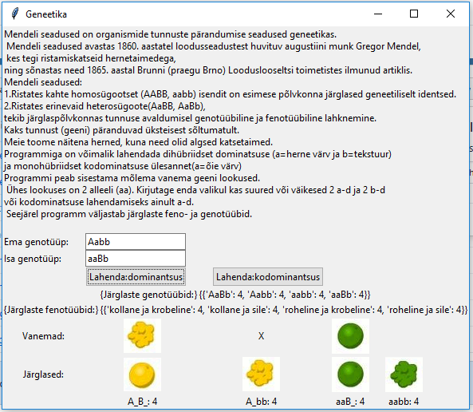

# Python application
Application done for University of Tartu programming basics class. Done as pair-work.
Application can be used to calculate pheno- and genotypes according to Mendel laws. 

Screenshot:

